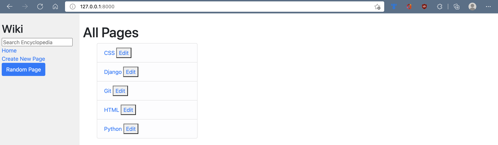
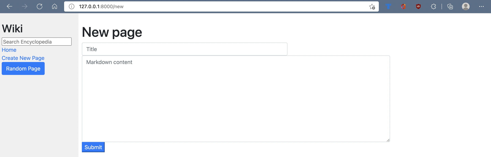
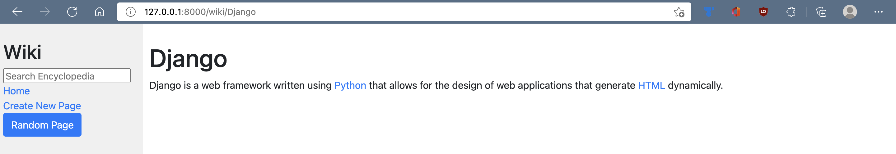
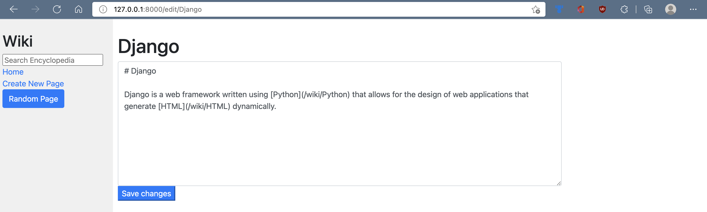
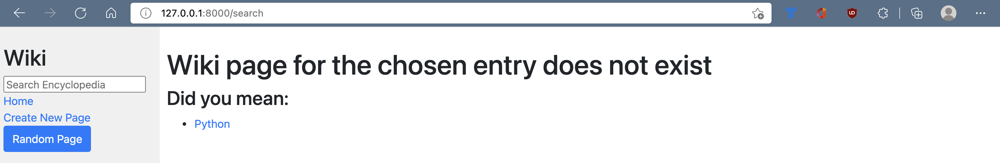

# Wiki
A Django web application which serves as a Wikipedia-like online encyclopedia, with functionalities such as searching, creating, and editing entries.

Each entry is written and stored as a markdown file in the /entries directory.

This is project 1 of the online course [CS50 Web](https://cs50.harvard.edu/web/2020/).

# Project goals
- Learning Django
- Creating & using Django forms
- Handling requests (GET and POST)
- Implementing basic CRUD operations

# Index page
The index page displays a list of all entries, from which you are able to view the entry, or edit its markdown content.

Index page:

# Creating an entry
Clicking on the "Create new page" button on the navigation displays a form which you can fill in to create a new entry.

# Viewing & editing
Click the name of the entry to view it, or click on the "edit" button to edit the contents of the entry.

The entry for Django, for example:

Entry pages may also contain links to other entry pages.

Editing the entry for Django:

# Searching
You can search for an entry in the search bar. The search is case-insensitive. Typing the exact title of an entry will take you directly to that entry's page. If the exact title is not found, the search will display similar results to what was searched for.

For example, searching "p" will display a suggestion to what you may have wanted to search:

# Random
Clicking on the "random" button in the navigation bar will take you to a random entry page.
